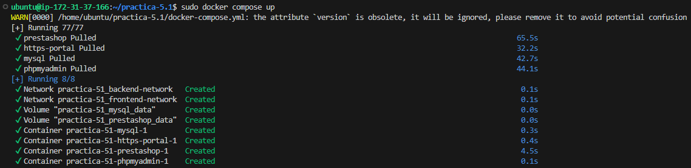
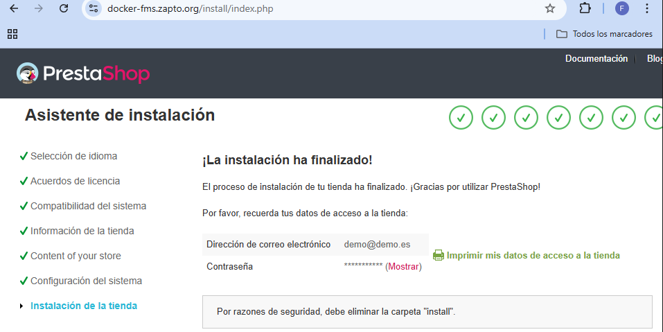

# practica-5.1
En esta práctica vamos a utilizar Docker y Docker Compose para la instalación de una PrestaShop.

Para ello necesitaremos un archivo `docker-compose.yml`, el instalador de Docker (en caso de no tenerlo instalado) y un archivo de configuraciones `.env`

A continuación dejo los contenidos de los archivos utilizados:

## instalar_docker.sh OPCIONAL
```bash
#Script de instalación de Docker y Docker Compose
#Referencia: https://docs.docker.com/engine/install/ubuntu/
set -x

#Actualizamos los repositorios
apt update

#Instalamos los paquetes necesarios para que apt pueda usar repositorios sobre HTTPS
apt install -y \
    ca-certificates \
    curl \
    gnupg \
    lsb-release

#Añadimos la clave GPG oficial de Docker
mkdir -p /etc/apt/keyrings
curl -fsSL https://download.docker.com/linux/ubuntu/gpg | gpg --dearmor -o /etc/apt/keyrings/docker.gpg

#Añadimos el repositorio oficial de Docker a nuestro sistema
echo \
  "deb [arch=$(dpkg --print-architecture) signed-by=/etc/apt/keyrings/docker.gpg] https://download.docker.com/linux/ubuntu \
  $(lsb_release -cs) stable" | sudo tee /etc/apt/sources.list.d/docker.list > /dev/null

#Actualizamos la lista de paquetes
apt update

#Instalamos la última versión de Docker y Docker Compose
apt install -y docker-ce docker-ce-cli containerd.io docker-compose-plugin

#Añadimos el usuario actual al grupo docker
usermod -aG docker $USER

#Habilitamos el servicio de Docker para que se inicie automáticamente al arrancar el sistema
systemctl enable docker

#Iniciamos el servicio de Docker
systemctl start docker
```

## docker-compose.yml
```yml
version: '3.4'

services:
  mysql:
    image: mysql:9.1
    ports: 
      - 3306:3306
    environment: 
      - MYSQL_ROOT_PASSWORD=${MYSQL_ROOT_PASSWORD}
      - MYSQL_DATABASE=${MYSQL_DATABASE}
      - MYSQL_USER=${MYSQL_USER}
      - MYSQL_PASSWORD=${MYSQL_PASSWORD}
    volumes: 
      - mysql_data:/var/lib/mysql
    networks: 
      - backend-network
    restart: always
  
  phpmyadmin:
    image: phpmyadmin:5.2.1
    ports:
      - 8080:80
    environment: 
      - PMA_ARBITRARY=1
    networks: 
      - backend-network
      - frontend-network
    restart: always
    depends_on: 
      - mysql

  prestashop:
    image: prestashop/prestashop:8
    environment: 
      - DB_SERVER=mysql
    volumes:
      - prestashop_data:/var/www/html
    networks: 
      - backend-network
      - frontend-network
    restart: always
    depends_on: 
      - mysql

  https-portal:
    image: steveltn/https-portal:1
    ports:
      - 80:80
      - 443:443
    restart: always
    environment:
      DOMAINS: "${DOMAIN} -> http://prestashop:80"
      STAGE: 'production' # Don't use production until staging works
      # FORCE_RENEW: 'true'
    networks:
      - frontend-network

volumes:
  mysql_data:
  prestashop_data:

networks: 
  backend-network:
  frontend-network:
```

## archivo .env
```
MYSQL_ROOT_PASSWORD=fran
MYSQL_DATABASE=prestashop
MYSQL_USER=fran
MYSQL_PASSWORD=a
DOMAIN=docker-fms.zapto.org
```

Ahora dejo unas capturas para verificar su funcionamiento:
### Captura del resultado del `docker-compose.yml`: 


### Parte 1: Comprobación de la página:


### Parte 2: Comprobación de la página:

